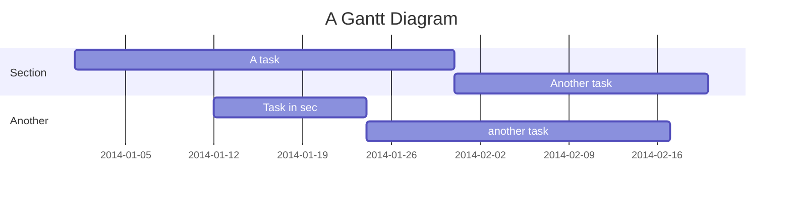

<link href="../font-awesome/css/font-awesome.min.css"  rel="stylesheet" type="text/css">

## **个人信息**
---
<i class="fa fa-male" aria-hidden="true"></i>:&ensp;李嘉文  
<i class="fa fa-phone" aria-hidden="true"></i>: 18123651019  
<i class="fa fa-envelope" aria-hidden="true"></i>: lijwxg@hotmail.com  
<i class="fa fa-rss-square" aria-hidden="true"></i>:  [lijwxg.github.io](https://lijwxg.github.io)

## **求职岗位**
---
<i class="fa fa-briefcase" aria-hidden="true"></i>: python开发工程师

## **工作经验**
---

## **技术栈**v
---


## **项目经验**
---
```sequence
title:communication

participant main
participant FuncA as A
participant FuncB as B
```

